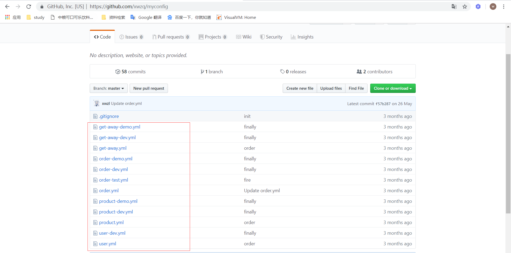
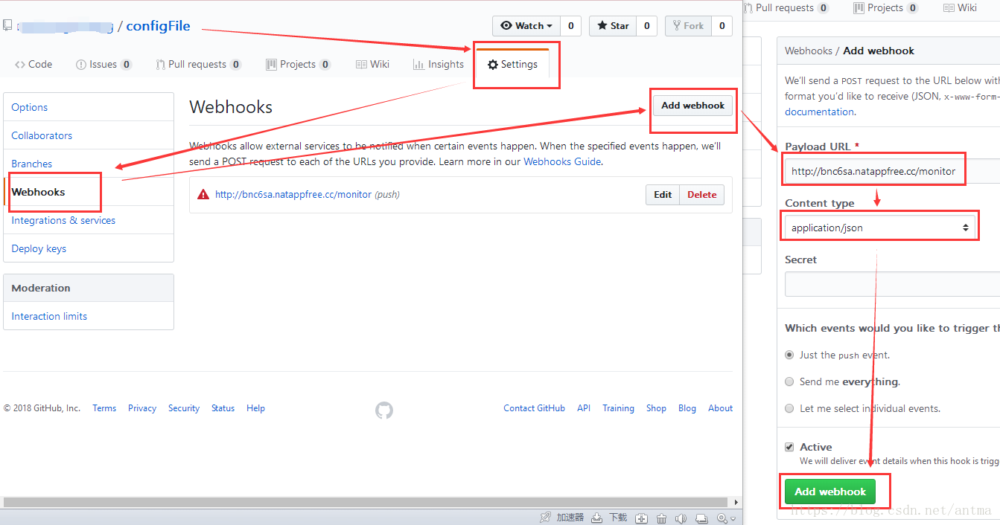

### 统一配置中心的目的是获取最新配置文件

SpringCloud 文件刷新的原理是监控 github 或者 gitee 项目的状态，当发生了 push
操作会触发项目的钩子函数，让项目启动的时候强制从服务器拉取最新的配置文件（在线刷新项目
配置应该是统一配置中心的亮点之一，唯一缺点就是配置线刷每次项目启动都要建立消息通道，因
此启动特别慢，后期改为 Spring Cloud Alibaba nacos 配置中心）。至于更新文件的形
式走的是消息队列的形式，具体如何实现，请阅读官网！

### 配置文件说明

github 的项目是存放改项目所有模块的配置信息。

yml 文件名中包含 -dev、-demo、-test 的东西都可以理解为 application.yml 与 application-dev.yml 的关系。

其中 order、product 等 yml 文件，为公共配置文件。例如 microsoft-order 模块中 order-server 的 bootstrap.yml 配置
文件中属性 spring.application.name = order,spring.profiles.active = dev , 项目启动时就会把 github 中 order.yml 
和 order-dev.yml 配置文件拉取下来，与本地的配置文件进行合并。

特别注意的一点是 spring.application.name = order 一定要配置，因为这个配置文件在注册中心表明自己的身份，你是负责哪个模块的服务。

具体使用见 order-server、product-server 等模块的使用

下图是 github 项目钩子函数的配置，详细数值参考此项目 github 的项目设置

