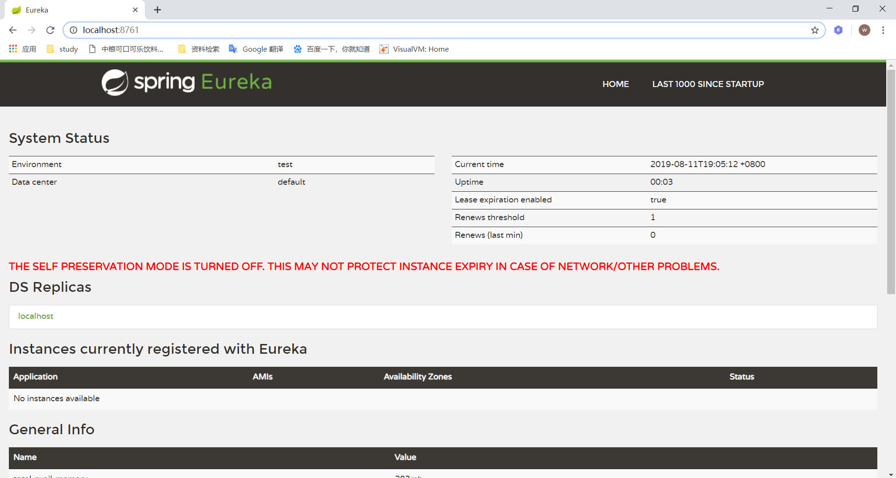
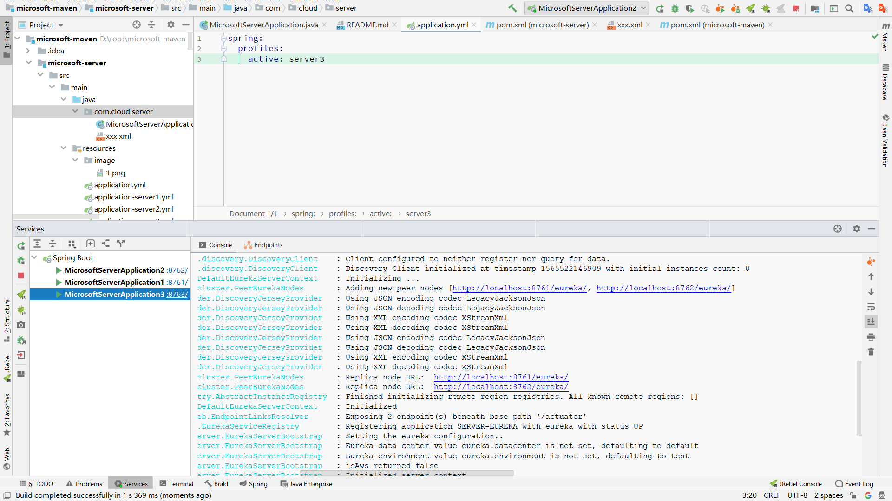
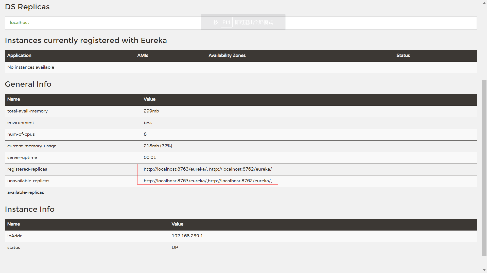

微服务注册中心 eureka , 注册中心可更换 zookeeper

注册中心可简单理解为一个微服务的管理中心，用于服务发现和服务调用

## server4 为单机注册中心

启动项目后查看[注册中心](http://localhost:8761)

## Eureka 高可用

分别激活 server1,server2,server3 配置文件，启动效果如下图：

8761、8762、8763 注册中心集群

到此，Spring Cloud 注册中心（统称为其它微服务的服务端，专门用来注册微服务的应用，为服务发现和服务调用提供生产者和消费者）已经启动完毕

接下来是 配置中心(config) 与 其他微服务（order,product,getway,user）
